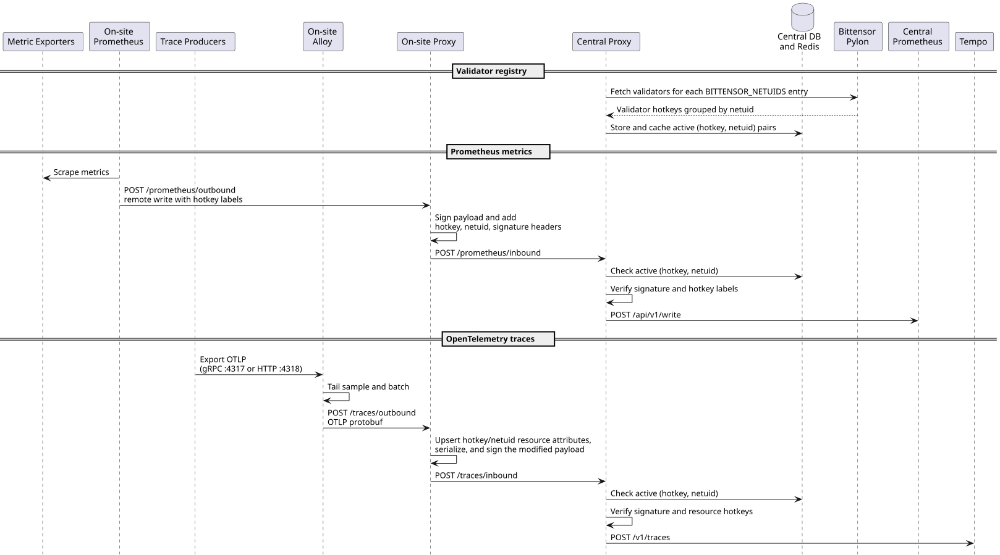

# bittensor-prometheus-proxy

A Bittensor-authenticated observability proxy for Prometheus remote-write metrics and OpenTelemetry traces.

The proxy can run in either of two roles:

| Role | Responsibility |
|---|---|
| On-site | Uses one validator wallet and one netuid, attaches that identity to telemetry, signs the payload, and sends it to a central proxy. |
| Central | Supports one or more netuids, checks the signed identity against the active validator set, validates the payload identity, and forwards accepted telemetry to Prometheus or Tempo. |

For metrics, the on-site Prometheus includes the validator hotkey as a label. The central proxy verifies that every
time series contains the authenticated hotkey. For traces, Grafana Alloy sends OTLP data to the on-site proxy, which
upserts `hotkey` and `netuid` resource attributes before signing it. The central proxy verifies the authenticated
hotkey on every OTLP resource before forwarding the request to Tempo.

The central role accepts a comma-separated `BITTENSOR_NETUIDS` allow-list such as `2,12,22`; every on-site deployment
continues to identify itself with one `BITTENSOR_NETUID`. Validator membership is synchronized independently for each
configured subnet through Bittensor Pylon.



See [Configuration](./docs/configuration.md) for role-specific environment variables and examples.

---

# Base requirements

- docker with [compose plugin](https://docs.docker.com/compose/install/linux/)
- python 3.11
- [pdm](https://pdm-project.org)
- [nox](https://nox.thea.codes)

# Setup development environment

```sh
./setup-dev.sh
docker compose up -d
cd app/src
pdm run manage.py wait_for_database --timeout 10
pdm run manage.py migrate
pdm run manage.py runserver 0.0.0.0:8000
```

The development Compose stack starts PostgreSQL, Redis, Bittensor Pylon, node exporter, on-site and central
Prometheus, Grafana Alloy, and Tempo. The default configuration uses the local Django process as both the on-site and
central proxy: metrics and traces enter its outbound endpoints, return through its inbound endpoints, and are then
written to the local Prometheus and Tempo instances.

This setup requires a working Bittensor wallet so Prometheus can add the hotkey label and the on-site proxy can sign
requests. Applications can export traces to Alloy over OTLP/gRPC on port `4317` or OTLP/HTTP on port `4318`.

Celery and Celery beat are not required for local development. Instead of periodically synchronizing validators
through Pylon, manually allow the development wallet for the configured subnet:

```bash
python manage.py debug_add_validator <hotkey> --netuid <netuid>
```

# Setup production environment (git deployment)

<details>

This sets up "deployment by pushing to git storage on remote", so that:

- `git push origin ...` just pushes code to Github / other storage without any consequences;
- `git push production master` pushes code to a remote server running the app and triggers a git hook to redeploy the application.

```
Local .git ------------> Origin .git
                \
                 ------> Production .git (redeploy on push)
```

- - -

Use `ssh-keygen` to generate a key pair for the server, then add read-only access to repository in "deployment keys" section (`ssh -A` is easy to use, but not safe).

```sh
# remote server
mkdir -p ~/repos
cd ~/repos
git init --bare --initial-branch=master bittensor-prometheus-proxy.git

mkdir -p ~/domains/bittensor-prometheus-proxy
```

```sh
# locally
git remote add production root@<server>:~/repos/bittensor-prometheus-proxy.git
git push production master
```

```sh
# remote server
cd ~/repos/bittensor-prometheus-proxy.git

cat <<'EOT' > hooks/post-receive
#!/bin/bash
unset GIT_INDEX_FILE
export ROOT=/root
export REPO=bittensor-prometheus-proxy
while read oldrev newrev ref
do
    if [[ $ref =~ .*/master$ ]]; then
        export GIT_DIR="$ROOT/repos/$REPO.git/"
        export GIT_WORK_TREE="$ROOT/domains/$REPO/"
        git checkout -f master
        cd $GIT_WORK_TREE
        ./deploy.sh
    else
        echo "Doing nothing: only the master branch may be deployed on this server."
    fi
done
EOT

chmod +x hooks/post-receive
./hooks/post-receive
cd ~/domains/bittensor-prometheus-proxy
sudo bin/prepare-os.sh
./setup-prod.sh

# adjust the `.env` file

mkdir letsencrypt
./letsencrypt_setup.sh
./deploy.sh
```

### Deploy another branch

Only `master` branch is used to redeploy an application.
If one wants to deploy other branch, force may be used to push desired branch to remote's `master`:

```sh
git push --force production local-branch-to-deploy:master
```

</details>


# Background tasks with Celery

## Dead letter queue

<details>
There is a special queue named `dead_letter` that is used to store tasks
that failed for some reason.

A task should be annotated with `on_failure=send_to_dead_letter_queue`.
Once the reason of tasks failure is fixed, the task can be re-processed
by moving tasks from dead letter queue to the main one ("celery"):

    manage.py move_tasks "dead_letter" "celery"

If tasks fails again, it will be put back to dead letter queue.

To flush add tasks in specific queue, use

    manage.py flush_tasks "dead_letter"
</details>


# Monitoring

Running the app requires proper certificates to be put into `nginx/monitoring_certs`,
see [nginx/monitoring_certs/README.md](nginx/monitoring_certs/README.md) for more details.

## Monitoring execution time of code blocks

Somewhere, probably in `metrics.py`:

```python
some_calculation_time = prometheus_client.Histogram(
    'some_calculation_time',
    'How Long it took to calculate something',
    namespace='django',
    unit='seconds',
    labelnames=['task_type_for_example'],
    buckets=[0.5, 1, *range(2, 30, 2), *range(30, 75, 5), *range(75, 135, 15)]
)
```

Somewhere else:
 
```python
with some_calculation_time.labels('blabla').time():
    do_some_work()
```


# Backups

<details>
<summary>Click to for backup setup & recovery information</summary>

## Setting up periodic backups

Add to crontab:

```sh
# crontab -e
30 0 * * * cd ~/domains/bittensor-prometheus-proxy && ./bin/backup-db.sh > ~/backup.log 2>&1
```

Set `BACKUP_LOCAL_ROTATE_KEEP_LAST` to keep only a specific number of most recent backups in local `.backups` directory.

## Configuring offsite targets for backups

Backups are put in `.backups` directory locally, additionally then can be stored offsite in following ways:

**Backblaze**

Set in `.env` file:

- `BACKUP_B2_BUCKET_NAME`
- `BACKUP_B2_KEY_ID`
- `BACKUP_B2_KEY_SECRET`

**Email**

Set in `.env` file:

- `EMAIL_HOST`
- `EMAIL_PORT`
- `EMAIL_HOST_USER`
- `EMAIL_HOST_PASSWORD`
- `EMAIL_TARGET`

## Restoring system from backup after a catastrophical failure

1. Follow the instructions above to set up a new production environment
2. Restore the database using bin/restore-db.sh
3. See if everything works
4. Set up backups on the new machine
5. Make sure everything is filled up in .env, error reporting integration, email accounts etc

</details>

# cookiecutter-rt-django

Skeleton of this project was generated using [cookiecutter-rt-django](https://github.com/reef-technologies/cookiecutter-rt-django).
Use `cruft update` to update the project to the latest version of the template with all current bugfixes and [features](https://github.com/reef-technologies/cookiecutter-rt-django/blob/master/features.md).
